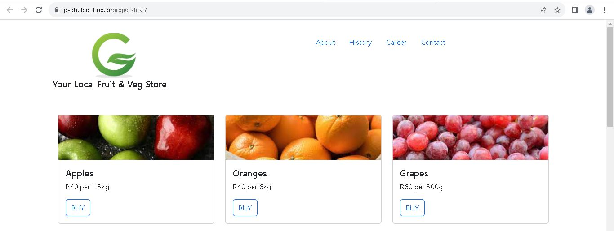

# project-first
The program creates a fruit and veg store 

## Content
1. Installation
2. Usage
3. Credit
4. Repository URL

## Installation

1. Clone the repository from https://github.com/P-Ghub/project-first.git.

2. Navigate to the project directory and open the index.html file using your IDE of choice, to view the file. 

## Usage

1. To see the store online. Go to this link: [Greens](https://p-ghub.github.io/project-first/)

## Credit
- Philisani ([P-Ghub](https://github.com/P-Ghub))

## URL Repository
https://github.com/P-Ghub/project-first.git